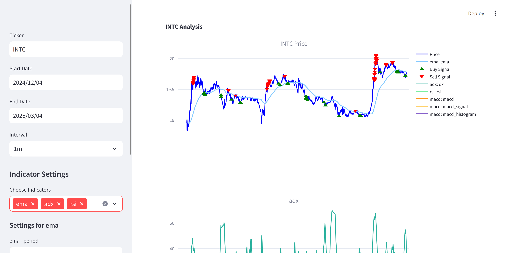

# Stock Market Analysis Platform


This repository provides a modular system for retrieving stock data, computing technical indicators, displaying interactive charts, and generating buy/sell signals based on a sample strategy. It leverages **Streamlit**, **yfinance**, and **tulipy** to offer a user-friendly interface for stock analysis and strategy prototyping.

---

## Table of Contents
1. [Project Structure](#project-structure)
2. [Features](#features)
3. [Installation](#installation)
4. [Usage](#usage)
5. [Components](#components)  
   5.1. [Main Application (`main.py`)](#main-application-mainpy)  
   5.2. [Submodules](#submodules)  
   5.3. [Strategy Layer (`strategy.py`)](#strategy-layer-strategypy)  
6. [Technical Overview](#technical-overview)  
   6.1. [Data Retrieval](#data-retrieval)  
   6.2. [Indicators](#indicators)  
   6.3. [Display & Visualization](#display--visualization)  
   6.4. [Strategy Logic](#strategy-logic)  
7. [Contributing](#contributing)
8. [License](#license)

---

## Project Structure
```
.
├── main.py
├── README.md
├── strategy.py
└── submodules/
    ├── data_retrieval.py
    ├── display.py
    └── indicators.py
```

- **`main.py`**: The primary entry point, runs a Streamlit app for user interaction.
- **`strategy.py`**: Contains the base strategy and a sample strategy for generating buy/sell signals.
- **`submodules/`**: A folder containing modular files:
  - **`data_retrieval.py`**: Fetches data from Yahoo Finance (or CSV).
  - **`display.py`**: Builds interactive Plotly charts.
  - **`indicators.py`**: Provides functions to compute various technical indicators using **tulipy**.
- **`archive/`**: Contains older or alternative scripts (e.g., `twitter_scraper.py`) not actively used in the current workflow.

---
## Features

1. **Data Retrieval**:
   - Pull real-time or historical data from Yahoo Finance via `yfinance`.
   - Handle different intervals (e.g., `1m`, `5m`, `1d`, `1mo`) with logic to avoid API issues.
   - Optionally load data from user-provided CSV files.

2. **Technical Indicators**:
   - Wide range of **tulipy** indicators available (e.g., MACD, EMA, RSI, ADX).
   - Dynamically configure indicator parameters (periods, etc.) through the user interface.

3. **Chart Visualization**:
   - Generate interactive Plotly charts with dynamic overlays for indicators.
   - Optional subplots for separate indicator panels.
   - Mark buy/sell signals on the price chart.

4. **Strategy Integration**:
   - Built-in sample strategy that demonstrates how to combine multiple indicators (MACD, RSI, ADX, EMA) to generate entry/exit signals.
   - Easy extension or customization of strategies in `strategy.py`.

5. **Streamlit Dashboard**:
   - User-friendly web UI for selecting ticker symbols, date ranges, intervals, and indicator parameters.
   - Run locally or on a server for real-time usage.

---
## Installation

1. **Clone the Repository**:
   ```bash
   git clone https://github.com/yourusername/stock-market-analysis.git
   cd stock-market-analysis
   ```
2. **Create a Virtual Environment (Recommended)**:
    ```bash
    python -m venv venv
    source venv/bin/activate  # on macOS/Linux
    # or
    venv\Scripts\activate     # on Windows
    ```
3. **Install Dependencies**:
    ```bash
    pip install streamlit yfinance tulipy plotly pandas numpy ib_async
    ```
    Make sure your Python version is compatible (3.8+ recommended due to dependencies like `tulipy`).

## Usage

1. **Run the Streamlit App**:
    ```bash
    streamlit run main.py
    ```
1. **Open Browser**: Streamlit will print a local URL (e.g., `http://localhost:8501`). Open this in your web browser.
    
2. **Select Parameters**:
    
    - **Ticker**: e.g., `INTC`
    - **Start Date** and **End Date**: Defines the time range.
    - **Interval**: e.g., `1m`, `5m`, `1d`, etc.
    - **Indicators**: Choose from any valid **tulipy** indicators. Provide numeric parameters (e.g., period lengths).

3. **View Results**:
    
    - Main chart (price history) with overlays (e.g., EMA).
    - Additional subplots (e.g., MACD, RSI).
    - Buy/Sell signals from the sample strategy, shown as markers on the main chart.

---

## Components

### 5.1. Main Application (`main.py`)

- A **Streamlit**-driven UI that handles user inputs (Ticker, Date Range, Interval).
- Retrieves data through `get_yfinance_data(...)` in **`data_retrieval.py`**.
- Collects selected indicators and their parameters; calls `compute_indicator(...)` in **`indicators.py`**.
- Initializes a `SampleStrategy` (from `strategy.py`) and obtains buy/sell signals.
- Displays everything via the `build_stock_chart(...)` function in **`display.py`**.

**Key blocks**:

- **User Input**: `st.sidebar.text_input`, `st.sidebar.date_input`, `st.sidebar.selectbox`.
- **Indicator Settings**: `st.sidebar.multiselect` and dynamic numeric inputs.
- **Strategy Computation**: `strategy = SampleStrategy(...)`; calls `generate_signals()`.
- **Chart Rendering**: `st.plotly_chart(...)`.

### 5.2. Submodules

#### `data_retrieval.py`

- **`get_yfinance_data(...)`**: Fetches OHLCV data from Yahoo Finance using **yfinance**.
    - Incorporates logic to limit date ranges for different intervals, circumventing API restrictions.
    - Returns NumPy arrays for `date_index`, `open`, `high`, `low`, `close`, `volume`.
- **`load_csv_data(...)`**: (Optional) load user-provided CSV if required. It expects columns: Date, Open, High, Low, Close, Volume.

#### `display.py`

- **`build_stock_chart(...)`**: Creates a multi-panel Plotly chart:
    - Primary panel for price (with optional overlays, e.g., EMA).
    - Additional panels for indicators like RSI or MACD.
    - Plots buy/sell signals as special markers if provided.

#### `indicators.py`

- **`indicator_info(...)`**: Retrieves metadata (name, type, input fields, parameter options) from **tulipy** for a given indicator.
- **`get_valid_indicators()`**: Returns all valid indicators recognized by **tulipy** for either overlay or standard indicator usage.
- **`compute_indicator(...)`**:
    - Dynamically constructs arguments (open, high, low, close, volume, plus user parameters).
    - Calls the **tulipy** function. Some indicators produce multiple outputs (e.g., MACD => MACD, signal, histogram).
    - Returns a tuple `(list_of_output_names, list_of_numpy_arrays)`.

### 5.3. Strategy Layer (`strategy.py`)

- **`BaseStrategy`** (abstract class):
    
    - Manages references to `price_data`, already-computed indicators, and user parameters.
    - **`ensure_indicators_loaded()`**: If a strategy requires specific indicators, it checks if they’re already computed. If not, computes them with default or user-provided params.
    - **`generate_signals()`**: An abstract method that child classes override to produce buy/sell signals.
- **`SampleStrategy`**:
    
    - Inherits from `BaseStrategy`.
    - **`required_indicators()`**: Specifies indicator defaults (`ema`, `macd`, `rsi`, `adx`) plus their typical parameters.
    - **`generate_signals()`**: Demonstrates a rudimentary multi-indicator strategy.
        - Example signal logic:
            - **Buy** if MACD > MACD signal, MACD signal < 0, ADX >= 20, and RSI <= 40.
            - **Sell** if MACD < MACD signal, MACD signal > 0, ADX >= 20, and RSI >= 60.

---

## Technical Overview

### 6.1. Data Retrieval

- **`yfinance`** is used to download OHLCV data.
- Different intervals impose maximum date ranges (e.g., `1m` data can only be fetched for ~30 days). The code in `data_retrieval.py` automatically segments or adjusts queries to avoid errors.

### 6.2. Indicators

- **tulipy** library underpins the technical analysis.
- Each indicator has:
    - **Inputs** (required data arrays: close, high, low, etc.).
    - **Options** (numeric parameters like `period`).
    - **Outputs** (one or more arrays, e.g., MACD => [macd, signal, histogram]).
- The user picks which indicators to compute via the Streamlit UI. Additional parameters can be adjusted there.

### 6.3. Display & Visualization

- **Plotly** is leveraged in `display.py` to present:
    - Candlestick or line charts (line by default).
    - Indicator overlays on the main chart (e.g., EMA).
    - Separate subplot panels for indicators such as RSI or MACD.
    - Buy/Sell markers from the strategy.

### 6.4. Strategy Logic

- Strategies can be as simple or as complex as needed:
    - Overriding `required_indicators()` ensures the strategy has all it needs.
    - `generate_signals()` uses indicator arrays for logical conditions.
    - Return arrays of timestamps and prices for buy/sell events.